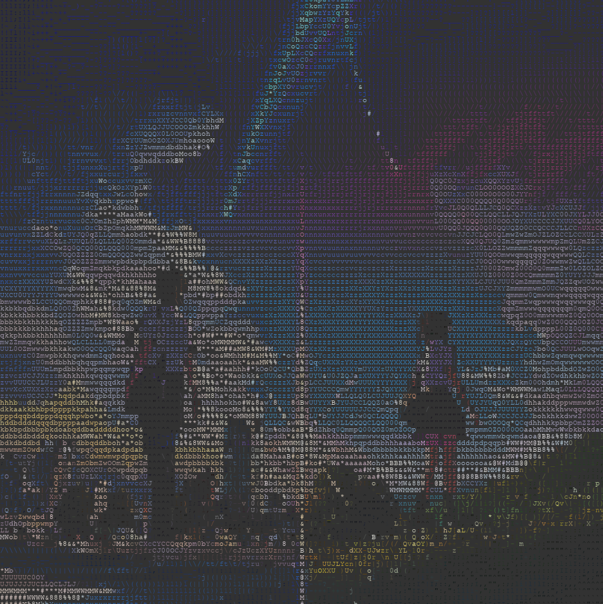
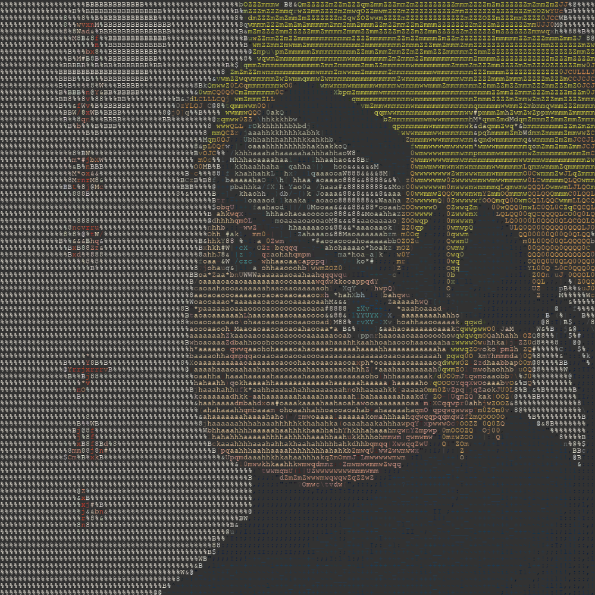

## **Python**

#### **Notes**
- Python: Methods for Reading Inputs [ [200801](./Notes/200801.md) ]
- Coding Bat Solutions [ [PG1_N1](./Notes/PG1_N1.py) ]

#### **Projects**
- [ [P1](./Projects/P1_Calculator.py) ] Calculator App
- [ [P2](./Projects/P2_JankenGame.py) ] Janken Game
- [ [P3](./Projects/P3_HighLowGame.py) ] HighLow Game
- [ [P4](./Projects/P4_HitBlowGame.py) ] HitBlow Game
- [ [P5](./Projects/P5_YasumiApp.py) ] Yasumi App
- [ [P6](./Projects/P6_AutoAttendance.py) ] Auto Attendance
- [ [P7](./Projects/P7_AnimateList.py) ] Animate List
- [ [P8](./Projects/P8_ImgToAscii.py) ] Img to ASCII
- [ [P9](./Projects/P9_MathGame.py) ] Simple Math Game
- [ [P11](./Projects/P11_dokoQLConverter.py) ] dokoQL Converter

#
#### **P8 Img to ASCII Output**

  
  
  

